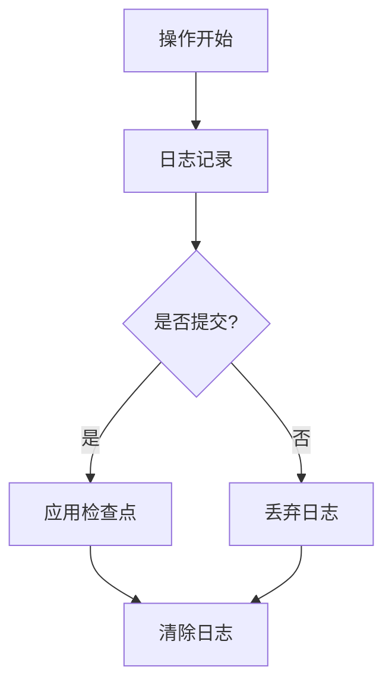

# Chapter 8 File system

​		文件系统的目的是组织和存储数据。文件系统通常支持用户和应用程序之间的数据共享，并提供持久性（即数据在系统重启后仍可用）。xv6文件系统提供**类Unix的文件、目录和路径名**（参见第1章），并通过**virtio磁盘**实现数据持久化。其设计需要应对以下挑战：

1. **磁盘数据结构**
   需要设计磁盘上的数据结构，以表示带名称的目录和文件的树形结构，记录存储文件内容的块标识，并追踪磁盘空闲区域。
2. **崩溃恢复**
   系统必须支持崩溃恢复（如断电后重启）。挑战在于崩溃可能中断更新操作，导致磁盘数据结构不一致（例如某个块同时被标记为"已分配给文件"和"空闲"）。
3. **多进程并发操作**
   不同进程可能同时操作文件系统，因此文件系统代码需要通过协调机制（如锁）维护数据一致性（invariants）。
4. **磁盘访问性能优化**
   磁盘访问速度比内存慢多个数量级，因此需要通过**内存缓存**缓存高频访问的磁盘块。

接下来，该章节将会解释xv6如何处理这些问题


##  8.1 Overview

xv6文件系统的实现采用七层架构（如图8.1所示），每一层都有特定的职责。以下是对各层的中文解释及技术细节分析：


1. **磁盘层（Disk Layer）**
   - 直接与Virtio虚拟硬盘交互，负责512字节扇区的原始读写操作
   - **块**（Block）是文件系统操作的**基本单位**（xv6使用1024字节块，是磁盘扇区大小的2倍）
   - 通过`struct buf`（定义于kernel/buf.h）在内存中缓存磁盘块数据
2. **缓冲缓存层（Buffer Cache）**
   - 核心机制：缓存最近访问的磁盘块（类似LRU缓存）
   - 同步控制：通过锁机制保证同一时间只有一个内核进程能修改特定块
   - 脏数据管理：标记修改过的块，延迟写回磁盘
3. **日志层（Logging Layer）**
   - 事务支持：将多个块更新打包为原子操作
   - 崩溃恢复：通过"write-ahead logging"机制保证事务的原子性
   - 日志结构：包含头块（记录事务元数据）和数据块序列
4. **inode层（Inode Layer）**
   - 文件表示：每个文件对应唯一的i-node结构，包含：
     - 文件类型（普通文件/目录/设备）
     - 文件大小
     - 12个直接数据块指针
     - 1个间接块指针（支持大文件）
   - 磁盘布局：连续存放多个inode（每个inode 64字节，每块16个）
5. **目录层（Directory Layer）**
   - 特殊inode类型：内容为目录项序列
   - 目录项结构：16字节（2字节inode编号 + 14字节文件名）
   - 支持基本操作：创建/删除/查找目录项
6. **路径名层（Pathname Layer）**
   - 分层解析：支持类似/usr/rtm/xv6/fs.c的路径
   - 递归查找：从根目录或当前目录开始逐级解析
   - 符号链接处理：支持路径别名机制
7. **文件描述符层（File Descriptor Layer）**
   - 统一抽象：将管道、设备、文件等抽象为文件描述符
   - 系统调用接口：提供open/read/write/close等POSIX API
   - 资源管理：维护进程的文件描述符表


**磁盘布局详解（图8.2）：**

- Block 0：引导扇区（保留）
- Block 1：超级块（Superblock），包含：
  - 魔数（标识文件系统类型）
  - 总块数
  - 日志块数
  - inode总数
  - 数据块总数
- Log区域：日志事务的存储空间
- Inode区域：连续存储所有inode
- 位图块：跟踪数据块使用状态（每个bit对应一个数据块）
- 数据块区：实际存储文件内容的区域


**关键设计思想：**

1. **层次抽象**：下层为上层提供简洁的接口（如缓冲缓存层隐藏了磁盘的异步特性）
2. **崩溃一致性**：通过日志层的事务机制保证元数据一致性
3. **空间管理**：位图块实现高效的空间分配回收（O(1)时间复杂度）
4. **缓存优化**：缓冲缓存减少磁盘I/O，采用类似时钟算法维护缓存块
5. **扩展性设计**：间接指针支持大文件（理论最大尺寸为 256KB + 64KB）


本章余下的部分将讨论每一层，从缓冲区缓存开始。

注意那些在较低层选择恰当的抽象可以简化较高层设计的情况。


##  8.2 Buffer cache layer


xv6的缓冲缓存层（Buffer Cache）是文件系统的核心组件，其设计体现了高效的资源管理和并发控制。以下是对该机制的逐层解析：

------

### **一、核心职责**

1. **访问同步**
   - **唯一副本保证**：通过睡眠锁（Sleep-lock）确保每个磁盘块在内存中仅存一份有效副本
   - **互斥访问**：同一时间仅允许一个内核线程操作特定缓冲区，防止数据竞争
2. **缓存优化**
   - **热块保留**：将**频繁访问的块**保留在内存，减少磁盘I/O次数
   - **LRU置换策略**：当缓存不足时，优先淘汰最近最少使用的缓冲区

------

### **二、关键数据结构**


------

### **三、核心接口运作流程**

#### **1. bread() - 获取缓冲区**


```c
// Return a locked buf with the contents of the indicated block.
struct buf*
bread(uint dev, uint blockno)
{
  struct buf *b;

  b = bget(dev, blockno);
  if(!b->valid) {
    virtio_disk_rw(b, 0);
    b->valid = 1;
  }
  return b;
}
```

- **bget流程**：
  - 遍历缓冲区链表，检查是否存在匹配的(dev, blockno)
  - 命中缓存：增加引用计数，获取睡眠锁
  - 未命中：选择LRU且引用计数为0的缓冲区，回收后重新分配


#### **2. bwrite() - 写回磁盘**

```c
// Write b's contents to disk.  Must be locked.
void
bwrite(struct buf *b)
{
  if(!holdingsleep(&b->lock))
    panic("bwrite");
  virtio_disk_rw(b, 1);
}
```

#### **3. brelse() - 释放缓冲区**

```c
// Release a locked buffer.
// Move to the head of the most-recently-used list.
void
brelse(struct buf *b)
{
  if(!holdingsleep(&b->lock))
    panic("brelse");

  releasesleep(&b->lock);

  acquire(&bcache.lock);
  b->refcnt--;
  if (b->refcnt == 0) {
    // no one is waiting for it.
    b->next->prev = b->prev;
    b->prev->next = b->next;
    b->next = bcache.head.next;
    b->prev = &bcache.head;
    bcache.head.next->prev = b;
    bcache.head.next = b;
  }
  
  release(&bcache.lock);
}
```

------

------

### **四、关键技术实现**

#### **1. 睡眠锁（Sleep-lock）**

- **特性**：
  - 允许等待线程让出CPU，避免忙等待
  - 通过`acquire_sleep()`和`release_sleep()`操作
- **应用场景**：适用于可能长时间持有的锁（如磁盘I/O等待）

#### **2. LRU置换策略**

- **维护机制**：

  - 双向链表管理所有缓冲区
  - 每次访问（bread/brelse）将缓冲区移至链表头部
  - 置换时选择链表尾部的缓冲区

#### **3. 脏数据管理**

- **隐式写回**：被置换的缓冲区若被修改（`b->dirty`），需先调用`bwrite()`
- **显式控制**：文件系统通过`log_write()`将修改纳入事务，确保原子性

------

### **五、并发场景示例**

假设两个线程同时请求块33：

1. **线程A**调用`bread(dev, 33)`
   - `bget`未找到缓存，选择LRU缓冲区B
   - 持有B的睡眠锁，启动磁盘读取
2. **线程B**此时调用`bread(dev, 33)`
   - `bget`发现块33正在被加载（B->valid=0且被锁定）
   - 在`sleep()`中等待锁释放
3. **磁盘中断**完成，线程A：
   - 设置B->valid=1，释放锁
4. **线程B**被唤醒，获得B的锁，直接返回有效数据

------

### **六、设计权衡与优化**

1. **固定缓存大小**：
   - 优点：实现简单，无动态内存分配开销
   - 缺点：可能限制大文件操作的性能
2. **LRU局限性**：
   - 顺序访问模式可能导致频繁缓存失效
   - 改进方案：可考虑加入二次机会（Clock）算法
3. **锁粒度**：
   - 全局LRU链表锁可能成为瓶颈
   - 优化方向：分片锁（Sharded locking）提升并发性

------

通过这种分层设计与精细化锁管理，xv6的缓冲缓存层在有限资源下实现了高效的磁盘访问控制，为上层文件系统提供了可靠的基础设施。


------


##  8.3 Code: Buffer cache

以下是对xv6缓冲缓存机制的中文解析，结合代码实现细节进行技术拆解：

------

### **一、缓冲缓存核心架构**

```c
// kernel/bio.c
struct {
    struct spinlock lock;          // 全局缓存锁
    struct buf buf[NBUF];          // 静态缓冲区数组
    struct buf head;               // 双向链表头（非数组元素）
} bcache;
```

- **双向链表管理**：通过`bcache.head`维护LRU链表，`buf`数组仅作初始存储
- **设计优势**：
  - 链表操作O(1)时间复杂度完成LRU调整
  - 静态数组避免动态内存分配开销
  - 头节点`head`作为哨兵简化边界判断

------

### **二、关键函数运作流程**

#### **1. binit() - 初始化**

```c
void
binit(void)
{
  struct buf *b;

  initlock(&bcache.lock, "bcache");

  // Create linked list of buffers
  bcache.head.prev = &bcache.head;
  bcache.head.next = &bcache.head;
  for(b = bcache.buf; b < bcache.buf+NBUF; b++){
    b->next = bcache.head.next;
    b->prev = &bcache.head;
    initsleeplock(&b->lock, "buffer");
    bcache.head.next->prev = b;
    bcache.head.next = b;
  }
}
```

- **链表构造**：创建环形双向链表，所有缓冲区初始插入头节点之后
- **锁初始化**：为每个缓冲区初始化睡眠锁

#### **2. bget() - 缓冲区获取**

```c
// Look through buffer cache for block on device dev.
// If not found, allocate a buffer.
// In either case, return locked buffer.
static struct buf*
bget(uint dev, uint blockno)
{
  struct buf *b;

  acquire(&bcache.lock);

  // Is the block already cached?
  for(b = bcache.head.next; b != &bcache.head; b = b->next){
    if(b->dev == dev && b->blockno == blockno){
      b->refcnt++;
      release(&bcache.lock);
      acquiresleep(&b->lock);
      return b;
    }
  }
    
   // Not cached.
  // Recycle the least recently used (LRU) unused buffer.
  for(b = bcache.head.prev; b != &bcache.head; b = b->prev){
    if(b->refcnt == 0) {
      b->dev = dev;
      b->blockno = blockno;
      b->valid = 0;
      b->refcnt = 1;
      release(&bcache.lock);
      acquiresleep(&b->lock);
      return b;
    }
  }
  panic("bget: no buffers");
}

```

- **双阶段锁定**：
  - 持有`bcache.lock`保护元数据操作
  - 获取缓冲区后立即释放全局锁，避免长时间阻塞
- **LRU实现技巧**：
  - 第一轮正向扫描（最近使用优先）
  - 第二轮反向扫描（选择最久未使用）

#### **3. bread() - 带数据保障的获取**


```c
// Return a locked buf with the contents of the indicated block.
struct buf*
bread(uint dev, uint blockno)
{
  struct buf *b;

  b = bget(dev, blockno);
  if(!b->valid) {
    virtio_disk_rw(b, 0);
    b->valid = 1;
  }
  return b;
}

```

- **延迟加载**：仅在首次访问时触发磁盘I/O
- **有效性标记**：`valid`位防止重复读取

#### **4. brelse() - 缓冲区释放**

```c
void brelse(struct buf *b) {
    releasesleep(&b->lock);  // 释放睡眠锁

    acquire(&bcache.lock);
    b->refcnt--;
    if (b->refcnt == 0) {
        // 调整LRU位置
        b->next->prev = b->prev;
        b->prev->next = b->next;
        b->next = bcache.head.next;
        b->prev = &bcache.head;
        bcache.head.next->prev = b;
        bcache.head.next = b;
    }
    release(&bcache.lock);
}
```

- **LRU更新**：引用计数归零时移至链表头部
- **线程安全**：修改链表结构时必须持有全局锁

------

### **三、并发控制设计**

1. **两级锁机制**：
   - `bcache.lock`（自旋锁）：保护缓冲区元数据操作
     - 作用范围：链表遍历、refcnt修改、LRU调整
     - 持有时间：尽可能短，通常在找到缓冲区后立即释放
   - `buf.lock`（睡眠锁）：保护缓冲区数据内容
     - 允许在I/O等待时让出CPU
     - 必须按固定顺序获取（先全局锁后睡眠锁）
2. **引用计数妙用**：
   - `refcnt > 0`时缓冲区不会被回收
   - 归零后通过LRU策略决定是否保留

------

### **四、设计局限与优化空间**

1. **全局锁瓶颈**：
   - 所有缓存操作需获取`bcache.lock`
   - 优化方案：分段锁（每个哈希桶一个锁）
2. **LRU效率问题**：
   - 全链表扫描时间复杂度O(n)
   - 改进方向：引入哈希表加速查找
3. **Panic处理**：
   - 缓冲区耗尽直接panic过于激进
   - 生产系统应实现等待队列+超时机制

------

### **五、典型工作流程示例**

**场景**：进程A读取块100，进程B随后写入同一块

1. **进程A调用bread(dev, 100)**：
   - bget()遍历链表找到空闲缓冲区
   - 加载数据后valid=1，返回锁定缓冲区
2. **进程B调用bread(dev, 100)**：
   - bget()发现已有缓冲区（refcnt=1）
   - 递增refcnt，等待获取睡眠锁
3. **进程A调用brelse()**：
   - 减少refcnt至0，移至LRU头部
   - 释放睡眠锁，唤醒等待进程B
4. **进程B获得缓冲区**：
   - 修改数据后调用bwrite()
   - 数据异步写回磁盘

------

通过这种精巧的双层锁结构和LRU管理策略，xv6的缓冲缓存在保证线程安全的前提下，实现了高效的磁盘访问加速。尽管存在优化空间，但其简洁的设计为教学和系统理解提供了优秀范例。

## 8.4 logging layer

xv6通过**日志事务机制**实现崩溃恢复，确保文件系统操作的原子性。以下为详细解析：

------

### **一、崩溃问题场景**

**案例**：文件截断操作（truncate）

1. 需要完成两个关键写入：
   - 更新inode的`size`字段为0
   - 释放数据块至空闲位图
2. **崩溃风险**：
   - 若先写inode后崩溃 ➔ 数据块泄露（未释放但inode已无引用）
   - 若先释放块后崩溃 ➔ 悬垂指针（inode指向已释放块）

------

### **二、xv6日志机制架构**

#### **磁盘布局**


- **日志区域结构**：
  - Header Block：记录事务元数据（块数、提交状态）
  - Data Blocks：按顺序存储待提交的修改

#### **操作流程**

1. **日志记录阶段**：

   ```c
   begin_op();                    // 开始事务
   log_write(inode_block);        // 记录inode修改
   log_write(bitmap_block);       // 记录位图修改
   end_op();                      // 提交事务
   ```

2. **提交过程**：

   - 将修改内容写入日志区域
   - 原子写入提交记录（Header Block的commit标志）

3. **检查点应用**：

   - 将日志内容写入实际文件系统位置
   - 清除日志（写入未提交状态）

------

### **三、崩溃恢复处理**

**恢复流程**（`recover_from_log`函数）：

1. 读取日志Header Block
2. 检查commit标志：
   - **已提交**：重放日志中的所有写操作
   - **未提交**：丢弃日志内容
3. 清空日志区域

**状态转换图**：



------

### **四、关键技术细节**

1. **原子提交保证**：
   - 提交标志写入是单扇区原子操作
   - 使用磁盘的`WRITE_FUA`（强制单元访问）确保写入顺序
2. **幂等性设计**：
   - 日志重放可安全重复执行（如多次设置块为空闲）
   - 通过日志序号或版本号避免重复（xv6简化处理）
3. **并发控制**：
   - `log.lock`自旋锁保护日志元数据
   - 支持多个系统调用合并到单个事务（通过`log.outstanding`计数）
4. **空间管理**：
   - 日志区大小固定（由`superblock`定义）
   - 事务大小超过日志容量时，分批处理


------

通过这种日志机制，xv6实现了**崩溃一致性**（Crash Consistency），确保文件系统操作在面临意外断电或系统崩溃时，仍能保持数据结构的完整性。虽然与现代文件系统（如ext4、ZFS）相比功能较为基础，但其设计思想为理解复杂日志系统奠定了重要基础。


## 8.5 log design

**日志机制实现细节**

日志位于磁盘上通过超级块指定的固定位置，包含一个**头部块**和一系列更新后的块副本（称为“日志块”）。头部块包含以下内容：

1. **扇区号数组**：每个条目对应一个日志块的实际磁盘位置
2. **日志块计数**：表示当前有效日志块数量
   - 计数为 **0**：表示日志中没有待处理事务
   - 计数为 **非零**：表示存在已完整提交的事务，数值指明日志块数量

xv6仅在事务提交时写入头部块（此时设置非零计数），在将日志块复制到文件系统实际位置后，将计数重置为0。这种设计保证：

- 事务中途崩溃 ➔ 头部块计数保持0（视为未提交）
- 提交后崩溃 ➔ 头部块保持非零计数（触发恢复）

------

**系统调用与事务原子性**
每个系统调用需明确标识其磁盘写入序列的**原子性边界**（通过`begin_op()`和`end_op()`）。为支持多进程并发执行文件操作，日志系统允许：

- **组提交（Group Commit）**：合并多个系统调用的写入到单个事务
- **提交条件**：仅当无进行中的文件系统调用时提交事务

组提交优势：

1. **降低I/O开销**：分摊提交操作固有成本（如头部块写入）
2. **提升磁盘效率**：批量写入可能利用单次磁盘旋转完成
   （注：xv6的virtio驱动暂不支持此优化，但设计保留扩展能力）

------

**日志空间限制与应对**
xv6为日志分配固定磁盘空间，导致两个关键约束：

1. **单系统调用写入限制**
   - 单个调用写入的**不同块数**不得超过日志容量
   - 主要影响操作：
     - **大文件写入**：可能涉及多个数据块+位图块+inode块
     - **文件删除（unlink）**：可能涉及多个位图块+inode块
   - xv6解决方案：
     - 拆分大文件写入为多个符合日志容量的小写入
     - 通过单一位图块设计规避unlink问题（实际仅需1个位图块）
2. **空间预留机制**
   - 系统调用启动前必须确保其所有写入能完整放入日志剩余空间
   - 实现方式：通过`begin_op()`中的空间检查阻塞调用，直到日志有足够空间

------

**设计总结**
xv6通过固定日志区域、原子提交标志和组提交机制，在有限资源下实现了崩溃一致性保障。其简洁性使其成为理解文件系统日志机制的经典范例，尽管在性能优化（如日志压缩、异步写入）方面存在提升空间。

## 8.6 code logging

以下是对xv6操作系统日志系统描述的翻译：

日志系统的非常规使用示例如下：

```c
begin_op();
...
bp = bread(...);
bp->data[...] = ...;
log_write(bp);
...
end_op();
```

**begin_op**（kernel/log.c:126）：

- 等待直到日志系统未处于提交状态
- 确保有足够的未保留日志空间容纳本次系统调用的写操作
- 通过log.outstanding统计已保留日志空间的系统调用数
- 总保留空间 = log.outstanding × MAXOPBLOCKS
- 增加log.outstanding既保留空间又防止提交在此系统调用期间发生
- 保守假设每个系统调用最多写入MAXOPBLOCKS个独立块

**log_write**（kernel/log.c:214）：

- 作为bwrite的代理
- 在内存中记录块的扇区号，为其在磁盘日志中保留槽位
- 固定缓冲区防止块缓存驱逐（直到提交前必须驻留缓存）
- 实现"吸收"优化：检测同一事务中多次写入的块，分配相同日志槽位
- 优势：节省日志空间，提升性能（只需写入磁盘块的一个副本）

**end_op**（kernel/log.c:146）：

1. 减少未完成系统调用计数
2. 当计数归零时，通过commit()提交事务：
   a. **write_log()**（kernel/log.c:178）：将修改块从缓冲区缓存复制到日志槽位
   b. **write_head()**（kernel/log.c:102）：写入头块到磁盘（提交点，此时崩溃将触发日志重放）
   c. **install_trans()**（kernel/log.c:69）：将日志块写入文件系统对应位置
   d. 写入计数为0的日志头（防止后续事务与崩溃恢复冲突）

**恢复机制**：

- recover_from_log（kernel/log.c:116）由initlog（kernel/log.c:55）调用
- 在启动时（fsinit → kernel/fs.c:42）首个用户进程运行前（kernel/proc.c:539）执行
- 读取日志头，若存在已提交事务则模拟end_op操作

**文件写入示例**（filewrite @ kernel/file.c:135）：

```c
begin_op();
ilock(f->ip);
r = writei(f->ip, ...);
iunlock(f->ip);
end_op();
```

- 包裹在分解大写入的循环中，避免日志溢出
- writei在本事务中可能写入：文件inode、位图块、数据块等多类块
- 通过分次事务处理确保单个事务仅包含少量扇区写入

该日志系统通过：

1. 原子事务保证崩溃一致性
2. 顺序日志写入优化磁盘操作
3. 写吸收减少冗余I/O
4. 提交点明确划分事务边界
5. 恢复机制确保崩溃后数据完整性

（注：保留代码行号便于对照xv6源码，MAXOPBLOCKS是预定义的最大操作块数常量）

## 8.7Code ： Block allocate

### 磁盘块分配机制

文件与目录内容存储于**磁盘块**中，这些块需从空闲池分配。xv6通过**磁盘位图**(bitmap)管理空闲块，每个块对应一个位：

- **0**：空闲块
- **1**：已占用块
  `mkfs`工具初始化时设置以下系统保留块的位：引导扇区、超级块、日志块、inode块及位图块自身。

------

### 核心函数

块分配器提供两个关键函数：

1. **balloc**（块分配）
   - **位置**：`kernel/fs.c:71`
   - **逻辑**：
     遍历块号0至`sb.size`（文件系统总块数），寻找位图中标记为0的空闲块。
     找到后更新位图并返回该块号。
   - **优化**：
     - **外层循环**：逐块读取位图块
     - **内层循环**：检查单个位图块内所有位（每个位图块管理`BPB`(Bits Per Block)个块）
   - **并发控制**：
     缓冲区缓存保证同一时刻仅一个进程访问特定位图块，天然避免竞态条件。

```c

// Allocate a zeroed disk block.
static uint
balloc(uint dev)
{
  int b, bi, m;
  struct buf *bp;

  bp = 0;
  for(b = 0; b < sb.size; b += BPB){
    bp = bread(dev, BBLOCK(b, sb));
    for(bi = 0; bi < BPB && b + bi < sb.size; bi++){
      m = 1 << (bi % 8);
      if((bp->data[bi/8] & m) == 0){  // Is block free?
        bp->data[bi/8] |= m;  // Mark block in use.
        log_write(bp);
        brelse(bp);
        bzero(dev, b + bi);
        return b + bi;
      }
    }
    brelse(bp);
  }
  panic("balloc: out of blocks");
}

```


> 总结这个函数，b以bit为单位，b.Size以block为单位，但是示位图每一个bit表示一个block，
>
> bp表示b所在的示位图block，bi就是在这个block中的第几个bit，进行循环，找到空闲的block，并记录将示位图所在的block进行修改，并记录，并将分配的block清0，这里brelse就解释了为什么logwite要bpin一下，如果不bpin一下，那就会引用值可能为0，就会直接回收该缓冲区

2. **bfree**（块释放）

- **位置**：`kernel/fs.c:90`
- **逻辑**：
  定位目标块对应的位图块，清除相应位。
- **并发控制**：
  依赖`bread`（获取带锁缓冲区）与`brelse`（释放缓冲区）的互斥语义，无需显式锁。

------

### 关键约束

- **事务性调用**：
  与文件系统多数操作相同，`balloc`与`bfree`**必须**在事务（如`begin_op`/`end_op`）内执行，确保：
  - 位图修改的原子性
  - 崩溃后通过日志恢复一致性

------

### 设计解析

1. **位图管理效率**
   - 分层遍历减少磁盘访问次数（先定位位图块，再检查内部位）
   - 空间换时间：位图需持久化存储，但快速定位空闲块
2. **隐式并发控制**
   - **缓冲区锁**：通过`bread`获取缓冲区时自动加锁，`brelse`释放锁
   - 示例：进程A读取位图块B时，进程B需等待块B缓冲区释放后才可访问
3. **事务集成必要性**
   - **场景**：文件创建涉及inode分配（更新inode位图）与数据块分配（更新数据位图）
   - **风险**：若未包裹在事务中，部分位图更新可能因崩溃丢失，导致空间泄漏
   - **解决**：事务保证位图修改要么全提交，要么通过日志回滚

------

### 代码示例

典型块分配事务流程：

```c
begin_op(); // 开始事务
struct buf *bp = bread(dev, BBLOCK(b, sb)); // 读取位图块
// ... 在bp中查找空闲位 ...
log_write(bp); // 记录位图修改到日志
brelse(bp);
end_op(); // 提交事务
```

------

### 附注

- **BPB计算**：
  `BPB = BSIZE * 8`（每个块包含`BSIZE`字节，每字节8位）
  例如：若块大小`BSIZE=1024`字节，则单个位图块可管理`1024*8=8192`个磁盘块
- **性能权衡**：
  位图需占用额外磁盘空间（约总块数的1/8192），但提供O(n)时间复杂度的分配效率，适用于中小型文件系统。

##  8.8 Inode layer

**术语 "inode" 有两种相关含义**：

1. 它可以指**磁盘上的数据结构**，包含文件的大小和数据块的编号列表；
2. 也可以指**内存中的inode**，包含磁盘inode的副本以及内核所需的额外信息。

**磁盘上的inode**：

- 被集中存储在磁盘的连续区域（称为**inode块**）。
- 每个inode大小相同，因此给定编号 `n` 可以直接定位到第 `n` 个inode。这个编号称为**inode号（i-number）**，是inode的唯一标识。
- 磁盘inode由结构体 `struct dinode`（定义于 `kernel/fs.h:32`）表示，包含以下字段：
  - `type`：区分文件、目录和特殊文件（如设备）。类型为0表示该inode空闲。
  - `nlink`：统计引用此inode的**目录条目数**，用于判断何时释放inode及其数据块。
  - `size`：文件内容的字节数。
  - `addrs`：存储文件内容所在的磁盘块号。

**内存中的inode**：

- 由结构体 `struct inode`（定义于 `kernel/file.h:17`）表示，是磁盘inode的副本。
- 仅当有C指针引用内存中的inode时，内核才会缓存它。
- `ref` 字段统计指向该inode的C指针数量，当引用计数归零时，内核从内存中释放inode（进程访问该inode节点的数量）。
- 函数 `iget()` 和 `iput()` 用于获取和释放inode指针，管理引用计数。指针可能来自文件描述符、当前工作目录或内核代码（如 `exec`）。

**四种锁机制**：

1. **icache.lock**：
   - 保证缓存中每个inode唯一存在。
   - 确保缓存inode的 `ref` 字段准确统计内存中指向它的指针数量。
2. **inode内部的睡眠锁（sleep-lock）**：
   - 保护inode字段（如文件长度）及其文件/目录内容块的独占访问。
3. **ref引用计数**：
   - 若 `ref > 0`，inode必须保留在缓存中，且缓存条目不可被其他inode复用。
4. **nlink链接计数**：
   - 统计目录条目对文件的引用数。若 `nlink > 0`，xv6不会释放该inode。

**关键操作**：

- `iget()` 返回的inode指针在调用 `iput()` 前始终有效。
- `iget()` 允许非独占访问，因此多个指针可指向同一inode（例如打开的文件或当前目录）。
- 必须调用 `ilock` 确保inode内容从磁盘加载并加锁；`iunlock` 释放锁。
- 分离“获取inode指针”（`iget`）和“加锁”（`ilock`）可避免死锁（如路径查找时）。

**缓存策略**：

- inode缓存的主要目的是同步多进程访问，缓存功能是次要的。
- 若inode频繁使用，缓冲区缓存（buffer cache）可能将其保留在内存中。
- 采用**直写（write-through）策略**：修改后的inode需立即通过 `iupdate` 写回磁盘。

## 8.9 Code : Inodes

**node分配函数 `ialloc`**

- 定义于 `kernel/fs.c:196`，功能是为新文件/目录分配磁盘inode。
- **操作逻辑**：
  1. 类似 `balloc`（块分配），逐块遍历磁盘的inode区域，寻找标记为“空闲”（`type == 0`）的inode。
  2. 找到空闲inode后，将其类型设置为新类型（如 `T_FILE` 或 `T_DIR`），并通过 `iget` 返回对应的内存inode指针（`kernel/fs.c:210`）。
- **并发安全**：依赖调用者对缓冲区锁（`bp`）的独占访问，确保不会出现多个进程同时认领同一inode。

**inode获取函数 `iget`**

- 定义于 `kernel/fs.c:243`，功能是从inode缓存中获取指定设备号和inode号的条目。
- **操作逻辑**：
  1. 遍历inode缓存，若找到活跃条目（`ip->ref > 0`）且匹配设备号与inode号，则增加其引用计数并返回（`kernel/fs.c:252-256`）。
  2. 若未找到，则使用首次遇到的空闲缓存槽位初始化新条目。
- **设计特点**：
  - 返回的inode**未加锁**，需调用 `ilock` 显式加锁后再访问元数据或内容。
  - 允许多个指针指向同一inode（如多个进程打开同一文件）。

**inode加锁与解锁**

- `ilock`（`kernel/fs.c:289`）：
  - 使用**睡眠锁（sleep-lock）**确保对inode的独占访问。
  - 若inode元数据未加载，则从磁盘（或缓冲区缓存）读取。
- `iunlock`（`kernel/fs.c:317`）：释放睡眠锁，唤醒等待该锁的进程。

**inode释放函数 `iput`**

- 定义于 `kernel/fs.c:333`，功能是递减inode的引用计数（`kernel/fs.c:356`）。
- **释放条件**：
  - 若引用计数归零且无目录链接（`nlink == 0`）：
    1. 调用 `itrunc` 释放文件数据块。
    2. 将inode类型标记为0（空闲）。
    3. 将inode写回磁盘（`kernel/fs.c:338`）。
- **并发安全**：
  - 引用计数归零时，其他线程无法通过系统调用获取该inode的引用（因无目录链接）。
  - `ialloc` 可能在 `iput` 释放后重用该inode，但需等待睡眠锁，确保操作原子性。

**崩溃恢复的挑战**

- **问题**：若文件链接计数归零但仍有进程持有引用（如未关闭的文件描述符），崩溃后磁盘inode仍标记为已分配，但无目录项指向它，导致空间泄漏。
- **解决方案**：
  1. **启动时扫描**：系统恢复后遍历所有inode，释放无链接但标记为已分配的inode。
  2. **记录未释放inode**：在超级块中维护列表，记录链接计数归零但引用未归零的inode，待引用归零后释放。
- **xv6的缺陷**：未实现上述机制，可能导致磁盘空间浪费。


## 8.10 Code:Inode content

### **磁盘上的Inode结构（struct dinode）**

- **组成**：包含文件大小（`size`）和一个块号数组（`addrs[]`）。
- **数据块存储**：文件数据存储在`addrs[]`数组指向的磁盘块中。
  - **直接块（Direct Blocks）**：前 `NDIRECT` 个条目直接指向数据块，存储文件的前 `NDIRECT * BSIZE` 字节（例如12KB，假设`NDIRECT=12`, `BSIZE=1024`）。
  - **间接块（Indirect Block）**：`addrs[NDIRECT]` 指向一个间接块，该块存储后续 `NINDIRECT` 个数据块的地址，最多扩展 `NINDIRECT * BSIZE` 字节（例如256KB，假设`NINDIRECT=256`）。

------

### **关键函数解析**

#### **1. `bmap` 函数**

- **功能**：根据**逻辑块号** `bn` 查找或分配对应的**物理磁盘块**。
- **逻辑**：
  - **直接块处理**：若 `bn < NDIRECT`，直接从 `addrs[bn]` 获取块号。若未分配（值为0），则调用 `balloc` 分配新块。
  - **间接块处理**：若 `bn >= NDIRECT`，需通过间接块：
    1. 检查 `addrs[NDIRECT]` 是否已分配间接块。若未分配，分配并初始化。
    2. 从间接块中读取第 `(bn - NDIRECT)` 个条目。若条目为0，分配新块并更新。
  - **错误处理**：若 `bn` 超出最大范围（`NDIRECT + NINDIRECT`），触发panic（但`writei`会预先检查避免）。

#### **2. `itrunc` 函数**

- **功能**：释放文件所有数据块，重置文件大小为0。
- **步骤**：
  1. **释放直接块**：遍历 `addrs[0..NDIRECT-1]`，释放非零块。
  2. **释放间接块**：
     - 若 `addrs[NDIRECT]` 非零，读取间接块，释放其所有非零条目指向的块。
     - 释放间接块本身，并将 `addrs[NDIRECT]` 置零。

#### **3. `readi` 与 `writei`**

- **`readi`**：
  - 检查偏移是否越界。若越界，返回错误或部分数据。
  - 循环处理每个块：通过 `bmap` 获取物理块，将数据从缓冲区拷贝到用户内存。


```c
int
readi(struct inode *ip, int user_dst, uint64 dst, uint off, uint n)
{
  uint tot, m;
  struct buf *bp;

  if(off > ip->size || off + n < off)
    return 0;
  if(off + n > ip->size)
    n = ip->size - off;

  for(tot=0; tot<n; tot+=m, off+=m, dst+=m){
    bp = bread(ip->dev, bmap(ip, off/BSIZE));
    m = min(n - tot, BSIZE - off%BSIZE);
    if(either_copyout(user_dst, dst, bp->data + (off % BSIZE), m) == -1) {
      brelse(bp);
      tot = -1;
      break;
    }
    brelse(bp);
  }
  return tot;
}

```

> readi 不断读入目标块，直到读完n个字节为止，dst为内存目标地址，如果user_dst为1表示该地址为用户虚拟地址空间。

- **`writei`**：
  - 允许扩展文件：若写入位置超出当前大小，更新文件大小（不超过最大限制）。
  - 类似 `readi`，但数据从用户内存拷贝到缓冲区。
  - 若文件扩展，更新inode的 `size` 字段。

#### **4. 特殊设备处理**

- 若 `ip->type == T_DEV`，表示文件对应特殊设备（如控制台），数据不存储在文件系统中，需调用设备驱动读写。

#### **5. `stati` 函数**

- 将inode元数据（类型、大小、链接数等）复制到 `stat` 结构体，供 `stat` 系统调用返回给用户程序。


## 8.11 Code: directory layer

**目录的内部实现**
xv6的目录在内部实现上与普通文件类似：

- 目录的inode类型为 `T_DIR`。
- 目录的内容由一系列**目录项（directory entry）**组成，每个目录项是一个 `struct dirent`（定义于 `kernel/fs.h:56`），包含：
  - `name`：文件名（最长 `DIRSIZ`（14）字符，不足时以 `NUL`（0）结尾。
  - `inum`：对应的inode号。若 `inum` 为0，表示该目录项空闲可用。

**目录查找函数 `dirlookup`**

- 定义于 `kernel/fs.c:527`，功能是在目录中搜索指定名称的目录项。
- 若找到匹配项：
  - 返回对应的**未加锁的inode指针**（通过 `iget` 获取）。
  - 设置 `*poff` 为该目录项在目录中的字节偏移量（便于后续编辑）。
- **为何返回未加锁的inode？**
  - 调用者已对目录的inode `dp` 加锁。若查找的是 `.`（当前目录别名），直接对 `dp` 重复加锁会导致死锁。
  - 类似的死锁场景可能出现在多进程操作父目录 `..` 时。
  - 调用者需先释放 `dp` 的锁，再对返回的inode `ip` 加锁，确保一次只持有一个锁。

**目录链接函数 `dirlink`**

- 定义于 `kernel/fs.c:554`，功能是向目录 `dp` 中写入新的目录项（指定名称和inode号）。
- **操作逻辑**：
  1. 检查名称是否已存在（遍历目录项），若存在则返回错误（`kernel/fs.c:560-564`）。
  2. 遍历目录项寻找空闲条目（`inum == 0`）：
     - 若找到空闲项，记录其偏移量 `off` 并提前终止循环（`kernel/fs.c:538-539`）。
     - 若未找到，则将 `off` 设为目录的末尾（`dp->size`）。
  3. 在偏移量 `off` 处写入新目录项（`kernel/fs.c:574-577`），必要时扩展目录大小。


## 8.12 code : path names

### **路径名查找的核心流程**

#### **1. 函数分工**

- **`namei`**: 解析完整路径（如 `/a/b/c`），返回目标文件或目录的inode。
- **`nameiparent`**: 解析路径的父目录（如解析 `/a/b/c` 时返回 `/a/b` 的inode），并将最后一个组件（`c`）复制到参数中。
- **`namex`**: 通用路径解析函数，被 `namei` 和 `nameiparent` 调用，负责实际的分步查找逻辑。

#### **2. 路径解析步骤（`namex`函数）**

1. **确定起始目录**：

   - 路径以 `/` 开头：从根目录（`ROOTDEV`）开始。
   - 否则：从当前进程的当前目录（`proc->cwd`）开始。

   ```c
   if (*path == '/') {
     ip = iget(ROOTDEV, ROOTINO); // 根目录的inode
   } else {
     ip = idup(proc->cwd);         // 当前目录的inode
   }
   ```

2. **逐组件解析路径**：

   - 使用 `skipelem` 分割路径，依次处理每个组件（如 `a`, `b`, `c`）。

     ```c
     while ((path = skipelem(path, name)) != 0) {
       // 处理当前组件
     }
     ```

3. **锁定与目录检查**：

   - 对当前目录的inode加锁（`ilock(ip)`），确保其类型（`ip->type`）已从磁盘加载。

   - 检查当前inode是否为目录（`T_DIR`），否则返回错误。

     ```c
     ilock(ip);
     if (ip->type != T_DIR) {
       iunlockput(ip);
       return 0;
     }
     ```

4. **处理 `nameiparent` 的特殊情况**：

   - 若调用的是 `nameiparent` 且当前组件是最后一个，提前终止循环，返回当前目录的inode。

     ```c
     if (nameiparent && !*path) {
       iunlock(ip);
       return ip;
     }
     ```

5. **查找下一级目录项**：

   - 调用 `dirlookup` 在当前目录中查找组件名对应的inode（`next`）。

   - 释放当前目录锁，将 `ip` 更新为 `next`，继续解析后续组件。

     ```c
     next = dirlookup(ip, name, 0);
     iunlockput(ip); // 释放当前目录锁
     ip = next;      // 切换到下一级目录
     ```

------

### **并发处理与竞态避免**

#### **1. 并发路径查找**

- **目录锁分离**：每个目录的锁独立，允许不同线程同时查找不同目录。
- **非阻塞设计**：若某线程因磁盘I/O阻塞，其他线程仍可继续处理其他路径。

#### **2. 避免已删除目录的访问**

- **引用计数（`iget`）**：

  - `dirlookup` 返回的inode通过 `iget` 增加引用计数。
  - 即使其他线程调用 `unlink` 删除目录项，只要引用计数 > 0，inode不会被释放。

  ```c
  struct inode* dirlookup(struct inode *dp, char *name, uint *poff) {
    // ...
    inum = de.inum;
    return iget(dp->dev, inum); // 增加引用计数
  }
  ```

#### **3. 死锁预防**

- **锁顺序规则**：

  - 在获取下一目录的锁（`next`）前，先释放当前目录的锁（`ip`）。
  - 避免同一线程对多个锁的循环依赖（如处理 `.` 时 `ip` 和 `next` 指向同一inode）。

  ```c
  next = dirlookup(ip, name, 0);
  iunlockput(ip); // 先释放当前锁
  ilock(next);     // 再获取下一级锁
  ```

------

### **关键函数与机制**

#### **1. `iget` 与 `ilock` 的分离**

- **`iget`**：
  - 获取inode的引用，增加其引用计数（`ref`）。
  - 不保证inode数据已加载到内存，仅管理生命周期。
- **`ilock`**：
  - 锁定inode，确保其数据（如类型、块列表）已从磁盘加载。
  - 实现互斥访问，防止并发修改。

#### **2. `dirlookup` 实现**

- 遍历目录的数据块，逐项比较名称。

- 返回目标条目对应的inode，通过 `iget` 增加其引用计数。

  ```c
  struct inode* dirlookup(struct inode *dp, char *name, uint *poff) {
    for (off = 0; off < dp->size; off += sizeof(de)) {
      if (readi(dp, (char*)&de, off, sizeof(de)) != sizeof(de))
        panic("dirlookup read");
      if (de.inum == 0) continue;
      if (namecmp(name, de.name) == 0) {
        // 找到匹配项
        return iget(dp->dev, de.inum);
      }
    }
    return 0;
  }
  ```

#### **3. 目录项删除与引用计数**

- **`unlink` 操作**：删除目录项，但inode的释放延迟到引用计数归零。

  ```c
  void unlink(char *path) {
    // ...
    ilock(ip);
    if (ip->nlink == 0) {
      iunlockput(ip); // 若引用为0，释放inode
    } else {
      iunlock(ip);
    }
  }
  ```

------

### **示例场景**

#### **场景1：并发查找与删除**

- **线程A**：查找 `/a/b/c`，获取 `/a/b` 的锁并找到 `c` 的inode（引用计数+1）。
- **线程B**：删除 `/a/b/c`，但 `c` 的inode引用计数仍为1，未被释放。
- **结果**：线程A仍可安全访问 `c` 的inode，直到释放引用。

#### **场景2：避免死锁**

- **路径 `.` 查找**：
  - 当前目录为 `/a`，查找路径 `.`。
  - `dirlookup` 返回 `ip`（即 `/a` 的inode）作为 `next`。
  - 释放 `ip` 的锁后，再获取 `next` 的锁（实际是同一inode，但无死锁风险）。

------

### **总结**

xv6的路径名查找机制通过以下设计确保高效与安全：

1. **分步解析**：逐组件查找，减少内存占用。
2. **锁分离与引用计数**：支持并发访问，避免数据竞争和过早释放。
3. **死锁预防**：严格的锁获取顺序，避免循环依赖。
4. **延迟释放**：通过引用计数管理inode生命周期，提升稳定性。

该设计体现了经典UNIX文件系统的核心思想，平衡了性能、并发安全与资源管理，是理解操作系统文件系统实现的关键案例。

## 8.13 file descriptor layer


Unix系统将大多数资源（如设备、管道、文件）抽象为文件，通过**文件描述符层**实现统一访问。以下是对xv6文件描述符机制的详细解析：

------

### **核心数据结构与关系**

1. **文件描述符表**：

   - 每个进程拥有独立的**文件描述符表**，表中条目为索引（即文件描述符，如0、1、2），指向全局文件表（`ftable`）中的`struct file`。
   - 通过`open`、`dup`、`fork`等操作管理文件描述符的引用。

2. **全局文件表（`ftable`）**：

   - 系统范围内所有打开的文件由`struct file`数组`ftable`管理。

   - `struct file`结构：

     ```c
     struct file {
       enum { FD_NONE, FD_PIPE, FD_INODE } type; // 文件类型
       int ref;                // 引用计数
       char readable;          // 是否可读
       char writable;          // 是否可写
       struct pipe *pipe;      // 管道指针（若类型为FD_PIPE）
       struct inode *ip;       // inode指针（若类型为FD_INODE）
       uint off;               // 文件读写偏移量（仅FD_INODE有效）
     };
     ```

------

### **关键操作函数**

#### **1. 文件分配与释放**

- **`filealloc()`**：

  - 在`ftable`中寻找未使用的`struct file`（`ref == 0`），初始化其字段并返回。

  - **代码逻辑**：

    ```c
    for (f = ftable.file; f < ftable.file + NFILE; f++) {
      if (f->ref == 0) {
        f->ref = 1;
        return f;
      }
    }
    ```

- **`filedup(struct file *f)`**：

  - 增加文件的引用计数。

  - **代码逻辑**：

    ```c
    f->ref++;
    return f;
    ```

- **`fileclose(struct file *f)`**：

  - 减少引用计数，若归零则释放资源。

  - **释放逻辑**：

    ```c
    if (--f->ref > 0) return;
    if (f->type == FD_PIPE) {
      pipeclose(f->pipe, f->writable);
    } else if (f->type == FD_INODE) {
      iput(f->ip); // 减少inode引用计数，必要时释放
    }
    f->type = FD_NONE;
    ```

#### **2. 文件读写操作**

- **`fileread(struct file \*f, ...)`**：

  - **检查权限**：若文件不可读（`!f->readable`），返回错误。

  - **分发操作**：

    - **管道**：调用`piperead(f->pipe, ...)`。
    - **inode文件**：调用`readi(f->ip, ...)`，更新偏移量`f->off`。

  - **代码逻辑**：

    ```c
    if (f->type == FD_PIPE) {
      r = piperead(f->pipe, ...);
    } else if (f->type == FD_INODE) {
      ilock(f->ip);       // 加锁确保inode数据加载
      r = readi(f->ip, ...);
      iunlock(f->ip);     // 解锁
      f->off += r;        // 原子更新偏移量
    }
    ```

- **`filewrite(struct file \*f, ...)`**：

  - **检查权限**：若文件不可写（`!f->writable`），返回错误。

  - **分发操作**：

    - **管道**：调用`pipewrite(f->pipe, ...)`。
    - **inode文件**：调用`writei(f->ip, ...)`，更新`f->off`。

  - **代码逻辑**：

    ```c
    if (f->type == FD_PIPE) {
      r = pipewrite(f->pipe, ...);
    } else if (f->type == FD_INODE) {
      ilock(f->ip);
      r = writei(f->ip, ...);
      iunlock(f->ip);
      f->off += r;        // 原子更新偏移量
    }
    ```

------

### **并发控制与原子性**

#### **1. 锁机制**

- **inode锁**：`readi`和`writei`操作前需调用`ilock`锁定inode，确保：
  - 数据块和元数据（如文件大小、块列表）的加载完成。
  - 读写操作及偏移量更新的原子性（避免多线程竞争导致数据不一致）。
- **副作用**：偏移量`f->off`的更新在锁保护下原子完成，即使多个写操作并发执行，各自写入位置不会重叠，但数据可能交替。

#### **2. 引用计数**

- **`struct file`的`ref`字段**：跟踪文件被引用的次数，防止过早释放资源。
  - **示例**：进程A通过`fork`创建子进程B，B复制A的文件描述符，`ref`增至2。关闭A的描述符后，`ref`减至1，B仍可访问文件。

------

### **示例场景**

#### **场景1：独立打开同一文件**

- **进程A**和**进程B**分别调用`open("file.txt", O_RDONLY)`：
  - 各自获得独立的`struct file`，`ref=1`，`off`初始化为0。
  - 进程A读取100字节后，其`off=100`，进程B的`off`仍为0。

#### **场景2：共享文件描述符**

- **进程A**打开文件后调用`fork`创建**进程B**：
  - 子进程B继承父进程的文件描述符，指向同一个`struct file`，`ref=2`。
  - 若A读取50字节，`off`变为50，B随后读取时从50开始。

#### **场景3：并发写入**

- **进程A**和**进程B**同时写入同一文件：
  - 每次写操作前获取inode锁，确保`off`更新原子性。
  - 假设A写入"Hello"，B写入"World"，文件内容可能为"HelloWorld"或"WorldHello"，但不会部分覆盖。

------

### **设计优势与总结**

1. **统一接口**：通过文件描述符抽象不同资源，简化上层操作。
2. **引用计数**：安全管理资源生命周期，避免悬空指针。
3. **锁机制**：保证并发访问的正确性，特别是偏移量更新的原子性。
4. **扩展性**：支持多种资源类型（文件、管道、设备），便于添加新类型。

xv6的文件描述符层体现了Unix“一切皆文件”哲学，通过分层抽象和精细的并发控制，实现了高效且安全的资源管理。

## 8.14 code : system calls

### 系统调用实现与文件系统事务管理

xv6 通过底层文件系统提供的函数，实现了简洁高效的系统调用。以下是对 `sys_link`、`sys_unlink`、`create`、`sys_open` 和 `sys_pipe` 等关键系统调用的深入解析：

------

#### **1. 硬链接与删除：`sys_link` 与 `sys_unlink`**

- **`sys_link` 实现步骤**：

  1. **参数获取**：解析旧路径 `old` 和新路径 `new`。
  2. **校验旧路径**：
     - 检查 `old` 是否存在且不是目录（防止循环链接）。
     - 增加旧文件 inode 的链接计数 `ip->nlink`。
  3. **处理新路径**：
     - 通过 `nameiparent` 获取新路径的父目录 inode `dp` 和最终组件名。
     - 在父目录 `dp` 中创建新目录项，指向旧文件的 inode。
  4. **错误回滚**：
     - 若父目录与新文件不在同一设备（inode 号仅在同一设备唯一），需回滚 `ip->nlink` 的计数。

- **事务的原子性保障**：

  - 更新 `ip->nlink` 和创建目录项这两个操作必须原子完成。
  - **无事务的风险**：若先更新 `ip->nlink` 后崩溃，可能导致链接计数虚高但无实际目录项。
  - **事务机制**：确保两个操作要么全部提交，要么全部回滚，避免中间状态不一致。

- **代码逻辑示例**：

  ```c
  
  // Create the path new as a link to the same inode as old.
  uint64
  sys_link(void)
  {
    char name[DIRSIZ], new[MAXPATH], old[MAXPATH];
    struct inode *dp, *ip;
  
    if(argstr(0, old, MAXPATH) < 0 || argstr(1, new, MAXPATH) < 0)
      return -1;
  
    begin_op();
    if((ip = namei(old)) == 0){
      end_op();
      return -1;
    }
  
    ilock(ip);
    if(ip->type == T_DIR){
      iunlockput(ip);
      end_op();
      return -1;
    }
  
    ip->nlink++;
    iupdate(ip);
    iunlock(ip);
  
    if((dp = nameiparent(new, name)) == 0)
      goto bad;
    ilock(dp);
    if(dp->dev != ip->dev || dirlink(dp, name, ip->inum) < 0){
      iunlockput(dp);
      goto bad;
    }
    iunlockput(dp);
    iput(ip);
  
    end_op();
  
    return 0;
  
  bad:
    ilock(ip);
    ip->nlink--;
    iupdate(ip);
    iunlockput(ip);
    end_op();
    return -1;
  }
  ```

------

#### **2. 文件创建通用函数：`create`**（sysfile.c:242）

- **功能**：统一处理 `open(O_CREATE)`、`mkdir` 和 `mkdev` 的创建逻辑。
- **实现步骤**：
  1. **父目录查找**：调用 `nameiparent` 获取父目录 inode `dp`。
  2. **冲突检测**：
     - 使用 `dirlookup` 检查目标名称是否已存在。
     - **存在时的行为**：
       - 若为 `open` 创建普通文件且目标存在且是普通文件，视为成功。
       - 否则返回错误（如目录或设备文件已存在）。
  3. **分配新 inode**：
     - 调用 `ialloc` 分配新 inode，初始化类型和权限。
     - **目录的特殊处理**：添加 `.`（当前目录）和 `..`（父目录）条目。
  4. **链接到父目录**：在 `dp` 中创建目录项指向新 inode。
- **并发控制**：
  - 同时持有父目录 `dp` 和新 inode `ip` 的锁。
  - **死锁规避**：新 inode 未被其他进程引用，无需担心锁顺序。

------

#### **3. 文件打开：`sys_open`**(sysfile.c:287)

- **处理逻辑**：

  1. **路径解析**：
     - 若指定 `O_CREATE`，调用 `create` 创建新文件（返回已锁定的 inode）。
     - 否则调用 `namei` 查找现有文件（需手动加锁 `ilock`）。
  2. **权限检查**：
     - 目录文件只能以只读方式打开（防止直接写入目录结构）。
  3. **分配文件描述符**：
     - 从进程文件表中分配空闲条目，填充 `struct file` 信息（类型、偏移量等）。
  4. **安全性**：
     - 新文件仅在当前进程的文件表中存在，其他进程无法访问未完全初始化的文件。

- **代码流程**：

  ```c
  uint64
  sys_open(void)
  {
    char path[MAXPATH];
    int fd, omode;
    struct file *f;
    struct inode *ip;
    int n;
  
    if((n = argstr(0, path, MAXPATH)) < 0 || argint(1, &omode) < 0)
      return -1;
  
    begin_op();
  
    if(omode & O_CREATE){
      ip = create(path, T_FILE, 0, 0);
      if(ip == 0){
        end_op();
        return -1;
      }
    } else {
      if((ip = namei(path)) == 0){
        end_op();
        return -1;
      }
      ilock(ip);
      if(ip->type == T_DIR && omode != O_RDONLY){
        iunlockput(ip);
        end_op();
        return -1;
      }
    }
  
    if(ip->type == T_DEVICE && (ip->major < 0 || ip->major >= NDEV)){
      iunlockput(ip);
      end_op();
      return -1;
    }
  
    if((f = filealloc()) == 0 || (fd = fdalloc(f)) < 0){
      if(f)
        fileclose(f);
      iunlockput(ip);
      end_op();
      return -1;
    }
  
    if(ip->type == T_DEVICE){
      f->type = FD_DEVICE;
      f->major = ip->major;
    } else {
      f->type = FD_INODE;
      f->off = 0;
    }
    f->ip = ip;
    f->readable = !(omode & O_WRONLY);
    f->writable = (omode & O_WRONLY) || (omode & O_RDWR);
  
    if((omode & O_TRUNC) && ip->type == T_FILE){
      itrunc(ip);
    }
  
    iunlock(ip);
    end_op();
  
    return fd;
  }
  ```

------

#### **4. 管道创建：`sys_pipe`**

- **功能**：创建管道，返回两个文件描述符（读端和写端）。

- **实现步骤**：

  1. **参数处理**：用户空间传递用于存储两个描述符的数组地址。
  2. **管道分配**：调用 `pipealloc` 创建管道结构体 `struct pipe`。
  3. **文件描述符绑定**：
     - 分配两个 `struct file`，分别设置为读端和写端。
     - 将描述符安装到进程文件表中。

- **代码逻辑**：

  ```c
  uint64
  sys_pipe(void)
  {
    uint64 fdarray; // user pointer to array of two integers
    struct file *rf, *wf;
    int fd0, fd1;
    struct proc *p = myproc();
  
    if(argaddr(0, &fdarray) < 0)
      return -1;
    if(pipealloc(&rf, &wf) < 0)
      return -1;
    fd0 = -1;
    if((fd0 = fdalloc(rf)) < 0 || (fd1 = fdalloc(wf)) < 0){
      if(fd0 >= 0)
        p->ofile[fd0] = 0;
      fileclose(rf);
      fileclose(wf);
      return -1;
    }
    if(copyout(p->pagetable, fdarray, (char*)&fd0, sizeof(fd0)) < 0 ||
       copyout(p->pagetable, fdarray+sizeof(fd0), (char *)&fd1, sizeof(fd1)) < 0){
      p->ofile[fd0] = 0;
      p->ofile[fd1] = 0;
      fileclose(rf);
      fileclose(wf);
      return -1;
    }
    return 0;
  }
  ```

------

### **设计要点总结**

1. **事务简化并发**：通过原子操作集合（如 `ip->nlink` 更新与目录项创建）避免中间状态风险。
2. **统一创建接口**：`create` 函数抽象了不同文件类型的创建逻辑，减少代码冗余。
3. **锁的精细管理**：
   - `create` 同时持有父目录和新 inode 的锁，但通过分配顺序避免死锁。
   - `sys_open` 根据创建方式（`create` 或 `namei`）决定锁的获取时机。
4. **管道与文件系统集成**：通过文件描述符抽象管道，使得读写操作与普通文件一致。

xv6 的系统调用实现体现了 Unix 设计的简洁性与一致性，通过分层抽象和精细的并发控制，确保了文件系统的高效与安全。


## 8.15 real world

### xv6 文件系统的局限性与现代文件系统的演进

xv6 的文件系统设计体现了早期 Unix 系统的核心思想，但其在效率、扩展性、容错性等方面存在显著不足。以下是对 xv6 文件系统的关键限制及现代文件系统改进方案的对比分析：

------

#### **1. 缓冲区缓存（Buffer Cache）**

- **xv6 的设计**：
  - 使用简单的 **LRU（最近最少使用）** 策略管理缓存，通过链表实现淘汰机制。
  - 仅支持单链表查找，效率较低（时间复杂度为 O(n)）。
- **现代改进**：
  - **哈希表 + 堆**：用哈希表加速缓存查找（O(1)），堆管理 LRU 淘汰（O(log n)）。
  - **内存映射文件**：将文件缓存与虚拟内存系统集成，支持 `mmap` 直接访问文件数据，减少用户态与内核态拷贝。
  - **智能预读**：根据访问模式预加载数据块，提升连续读性能。

------

#### **2. 日志系统（Logging System）**

- **xv6 的不足**：
  - **同步写入**：每个日志块依次写入磁盘，导致高延迟（需等待磁盘旋转）。
  - **全块记录**：即使仅修改几个字节，仍需记录整个块，浪费带宽。
  - **缺乏并发**：日志提交期间无法处理其他系统调用。
- **现代优化**：
  - **异步日志提交**：允许日志写入与系统调用并发执行。
  - **增量日志**：仅记录被修改的字节，减少日志体积（如 **WAFL 文件系统**）。
  - **批量提交**：合并多个操作到单个事务，提高吞吐量（如 **ext4 的延迟分配**）。

------

#### **3. 崩溃恢复（Crash Recovery）**

- **xv6 的日志机制**：
  - 通过重放日志原子性恢复操作，速度快（秒级）。
- **传统替代方案**：
  - **fsck 文件检查**：需全盘扫描修复不一致，耗时久（小时级），且无法保证原子性。
- **现代趋势**：
  - **写时复制（Copy-on-Write）**：如 **ZFS/Btrfs**，通过数据快照避免日志，直接回滚到一致状态。
  - **元数据校验和**：检测静默数据损坏，结合冗余存储自动修复。

------

#### **4. 磁盘布局与目录结构**

- **xv6 的磁盘布局**：
  - **线性目录搜索**：目录条目以线性数组存储，查找需遍历所有块（O(n) 复杂度）。
  - **固定大小 inode 表**：无法动态扩展，限制文件系统容量。
- **现代优化**：
  - **B 树目录**：如 NTFS、HFS+，目录以平衡树结构存储，实现 O(log n) 查找（支持百万级文件）。
  - **动态 inode 分配**：如 ext4，按需分配 inode，支持更大文件系统。
  - **弹性布局**：如 ZFS，将磁盘管理与文件系统结合，支持动态扩容/缩容。

------

#### **5. 磁盘容错与高可用**

- **xv6 的缺陷**：
  - 磁盘操作失败直接 panic，无冗余机制。
- **现代方案**：
  - **硬件 RAID**：通过磁盘阵列实现数据冗余（如 RAID 5/6）。
  - **软件定义存储**：如 **Ceph** 或分布式文件系统，跨节点复制数据。
  - **端到端校验**：如 ZFS 的 **ECC 校验**，防止数据静默损坏。

------

#### **6. 扩展性与多设备支持**

- **xv6 的限制**：
  - 单设备固定大小，无法动态扩展。
- **现代技术**：
  - **逻辑卷管理（LVM）**：将多物理磁盘合并为逻辑卷，支持在线扩容。
  - **纠删码与条带化**：如 **RAID 0/5** 或分布式存储，提升吞吐量与容量。
  - **云存储集成**：如 **AWS EFS**，文件系统跨多服务器和存储介质。

------

#### **7. 现代文件系统的附加功能**

- **xv6 缺失的特性**：

  - 快照（Snapshot）、增量备份、去重（Deduplication）。
  - 网络文件系统（NFS）、内存文件系统（tmpfs）、虚拟文件系统（/proc）。

- **现代实现**：

  - **统一资源抽象**：通过 **VFS 层** 抽象文件、管道、网络套接字等，提供一致 API。

  - **函数指针表（Operations Table）**：为每种资源类型定义操作函数（如 `read()`, `write()`），支持多态调用。

    ```c
    struct file_operations {
      ssize_t (*read)(...);
      ssize_t (*write)(...);
      int (*mmap)(...);
    };
    
    // 示例：Ext4 文件操作
    static const struct file_operations ext4_file_operations = {
      .read = ext4_read,
      .write = ext4_write,
      .mmap = ext4_mmap,
    };
    ```

  - **用户态文件系统（FUSE）**：允许用户程序实现自定义文件系统，通过 RPC 与内核交互。

------

### **总结：xv6 的启示与现代演进**

xv6 文件系统作为教学模型，清晰展示了 Unix 核心设计（如 inode、目录项、文件描述符），但其简化设计也凸显了实际系统的复杂性。现代文件系统通过以下方向演进：

1. **性能优化**：高效缓存、并发日志、智能预读。
2. **可靠性增强**：写时复制、元数据校验、分布式冗余。
3. **扩展性支持**：动态扩容、多设备聚合、弹性布局。
4. **功能丰富化**：快照、去重、网络/虚拟文件系统。

这些改进使得文件系统能够适应从嵌入式设备到云数据中心的多样化场景，平衡性能、可靠性与功能需求。


## 8.16 exercise

1. Why panic in balloc ? Can xv6 recover?   

   

     

2.  Why panic in ialloc ? Can xv6 recover? 

   

   

3. Why doesn’t filealloc panic when it runs out of files? Why is this more common and therefore worth handling? 

   

   

4.  Suppose the file corresponding to ip gets unlinked by another process between sys_link ’s calls to iunlock(ip) and dirlink. Will the link be created correctly? Why or why not? 

   

   

5.  create makes four function calls (one to ialloc and three to dirlink) that it requires to succeed. If any doesn’t, create calls panic. Why is this acceptable? Why can’t any of those four calls fail? 

   

   

6.  sys_chdir calls iunlock(ip) before iput(cp->cwd) , which might try to lock cp->cwd , yet postponing iunlock(ip) until after the iput would not cause deadlocks. Why not?

   

7. Implement the lseek system call. Supporting lseek will also require that you modify filewrite to fill holes in the file with zero if lseek sets off beyond f->ip->size.

   

8. Add O_TRUNC and O_APPEND to open, so that > and >> operators work in the shell.

    

9.  Modify the file system to support symbolic links. 

   

10. Modify the file system to support named pipes. 

    

11. Modify the file and VM system to support memory-mapped files

